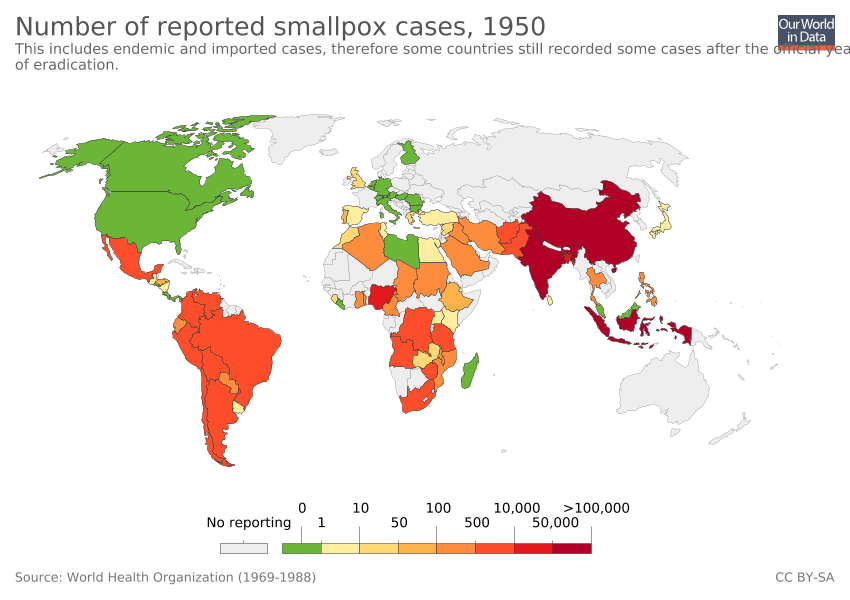

## Explaination of Smallpox Pandemic.

<head>
	<title> Tentang Wabah </title>
</head>
<body>

    <h1>Smallpox</h1>
  

  

    <ul id="navlist">
      <li><a href="index.html">Home </a></li>
      <li><a href="wabah.html">Wabah</a></li>
      <li><a href="kasus.html">Kasus Penyebaran</a></li>
      <li><a href="penanggulangan.html">Penanggulangan</a></li>
      <li><a href="aboutus.html">About Us</a></li>
    </ul>
  

	<h1> Gejala </h1>
	<h2> Gejala Cacar Air</h2>
	
 Gejala cacar air adalah ruam merah di perut atau punggung. Selain itu, cacar air juga ditandai dengan beberapa gejala lain seperti:

	   

      <ul>
        <li> Demam </li>
         <li> Pusing </li>
          <li> Lemas </li>
           <li> Nyeri Tenggorokan </li>
      </ul>
      

    

 
 	<h1> Pencegahan </h1>
 	<h2> Pencegahan Smallpox </h2>
 	
 Pengobatan cacar air bertujuan untuk mengurangi keparahan gejala yang dialami oleh pasien, dengan atau tanpa bantuan obat. Ada beberapa pengobatan mandiri yang bisa dilakukan untuk meringankan gejala, yaitu:
 		<ul>
			</li>Perbanyak minum dan mengonsumsi makanan yang lembut.</li>
			<li>Tidak menggaruk ruam atau luka cacar air.</li>
			<li>Mengenakan pakaian berbahan lembut dan ringan</li>
		</ul>
		

	<h1> Pengobatan </h1>
	<h2> Pengobatan Smallpox </h2>
	
 Sebagai upaya pencegahan penyakit cacar air, dianjurkan untuk melakukan vaksinasi cacar air atau vaksin varicella. Di Indonesia sendiri, vaksinasi cacar air tidak termasuk dalam daftar imunisasi rutin lengkap, tapi tetap dianjurkan untuk diberikan. 

	
	<h1>Awal mula virus smallpox</h1>

	
Virus smallpox adalah salah satu penyakit tertua yang menginfeksi manusia. Setelah berevolusi dari virus yang menginfeksi hewan lain, virus-virus tersebut pertama kali menyebar di antara masyarakat Eropa dan Afrika Utara ribuan tahun yang lalu. Virus-virus ini kemudian dibawa oleh orang Eropa ke benua Amerika pada masa penaklukan Spanyol. Penduduk asli Amerika tidak memiliki kekebalan alami terhadap virus-virus tersebut, sehingga jutaan dari mereka meninggal karenanya. Kalau melihat sejarahnya, Smallpox ternyata bukan ada beberapa abad lalu, melainkan sudah lama sekali. Hal ini diyakini oleh para peneliti yang secara pasti menemukan virus sejenis Smallpox di mumi Ramses V. Kalau dilihat dari waktu eksistensinya, Ramses V hidup setidaknya 3.000 tahun sebelum masehi. Jadi, bisa dibilang Smallpox juga berumur setua itu. Di Tiongkok, virus ini sudah ada sejak 1122 tahun sebelum masehi dengan bukti tulisan-tulisan serta kisah-kisah yang ada. Tak hanya di sini, India pun juga dijajah Smallpox sejak lama. Bahkan orang-orang sana dulu sampai menyembah dewa yang bernama Sitala Mata yang dianggap sebagai Dewi-nya Smallpox.

	<h2>Kawasan yang pernah terinfeksi virus smallpox</h2>

	
Dunia belahan mana yang tak tersentuh Smallpox? Hampir semua daerah di muka Bumi pernah merasakan ngerinya virus ini. Berawal dari Mesir, virus ini menyebar ke India, kemudian Tiongkok, Jepang, lalu ke wilayah Asia Tenggara. Eropa juga terjangkiti bahkan hampir semua daerahnya. Dari Eropa, Smallpox menyebar lagi ke Amerika dan juga Australia. Virus Smallpox mungkin lebih kecil dari batu kerikil sekalipun, tapi ia bisa memberikan teror yang benar-benar mendunia. Sejarah mencatat beberapa kali Smallpox dikemas menjadi senjata-senjata mematikan dalam perang Salah satu yang paling diingat adalah ketika Inggris menggunakan Smallpox untuk menghajar para Indian. Hasilnya benar-benar sangat fatal. Ketika itu, penghuni asli benua Amerika tersebut mengalami penurunan jumlah penduduk yang drastis. Setidaknya lebih dari 50 persen orang Indian meninggal lantaran Smallpox. Tak hanya itu, di Perang Dunia II senjata biologis berupa Smallpox juga terbukti digunakan oleh Inggris, Amerika Serikat, dan juga Jepang.

	<h3>Peta persebaran smallpox</h3>
	
	
	
	<h1>Penanggulangan</h1>
	
    <h2>Apa yang dilakukan pemerintah untuk mencegah penyebaran Smallpox..?</h2>
 <ol>
 	<li>Melakukan vaksinasi</li>
 	
Ini merupakan salah satu cara terbaik untuk mencegah cacar. Jika diberikan kepada seseorang sebelum terpapar cacar, vaksin benar-benar efektif untuk melindungi mereka. Vaksin cacar saat ini berlisensi, yang terdiri dari strain laboratorium virus vaccinia, sangat efektif dalam mencegah infeksi.Para ahli medis percaya vaksin dapat mengurangi keparahan, atau bahkan mencegah penyakit pada orang yang belum divaksinasi jika diberikan dalam waktu 4 hari setelah terpapar virus.

 	<li>Memberikan keringan biaya pengobatan bagi masyarakat terinfeksi.</li>
 	<li>Menghimbau masyrakat untuk lebih berhati-hati dan membiasakan gaya hidup bersih.</li>
 </ol>
    <h2> Bagaimana kesadaran masyarakat..?</h2>
    
Kasus penyakit cacar yang terakhir di dunia ditemukan di tahun 1977. Dari kasus terakhir yang ditemukan, total korban jiwa dari penyakit cacar mencapai  lebih 300 juta orang. Namun Pada tahun 1980, World Health Organization (WHO) menyatakan penyakit ini berhasil sepenuhnya dimusnahkan karena pengerahan vaksinasi global sejak tahun 1700. Maka dari itu, kesadaran masyrakat akan sebuah wabah sangatlah penting untuk menanggulangi wabah tersebut.

	
	

	
